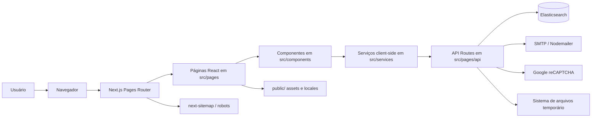
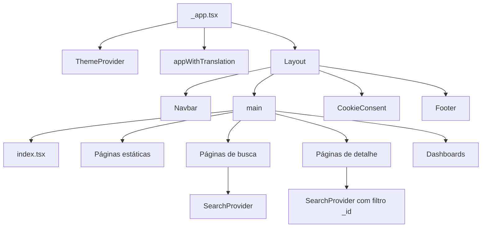
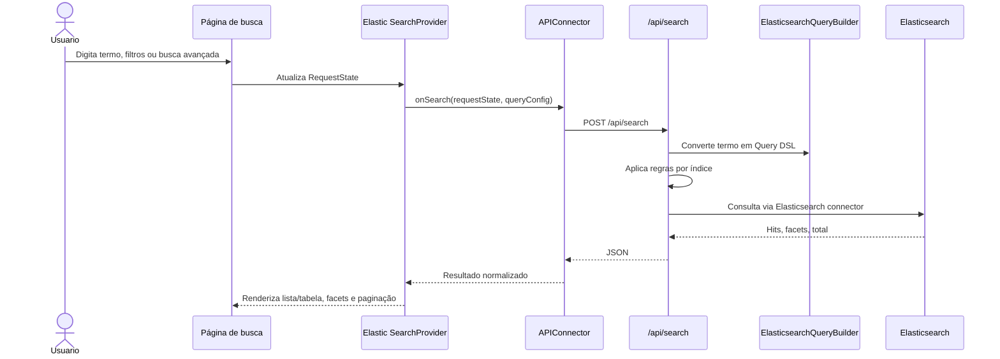
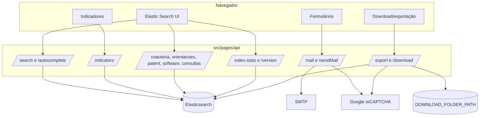
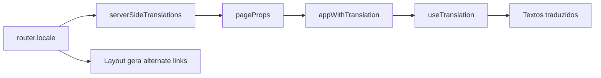
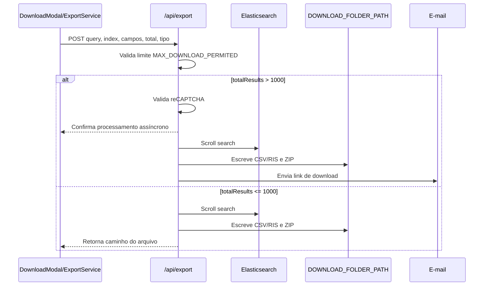
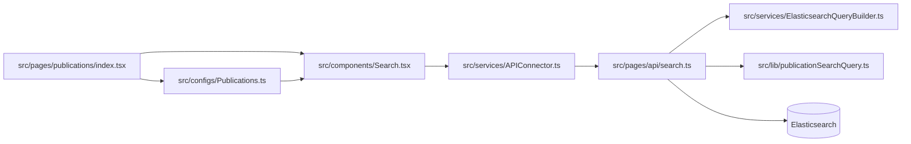

# Arquitetura do projeto BrCris Interface de Busca

Este documento descreve a arquitetura da aplicação `brcris-interface-busca` a partir da estrutura atual do código. O projeto é uma interface web em Next.js para busca, visualização, indicadores e exportação de dados do ecossistema BrCris.

## Visão geral

A aplicação usa Next.js com o roteador clássico baseado em `src/pages`. Não há uso do App Router (`src/app`). A interface é renderizada com React, Bootstrap/SCSS e componentes especializados de busca da Elastic. O backend da própria aplicação é composto por API Routes do Next.js em `src/pages/api`, usadas principalmente como proxy seguro para o Elasticsearch, envio de e-mail, validação de captcha, geração de exportações e consultas auxiliares.



## Pilha principal

- **Framework:** Next.js `15.x` com React `18.x`.
- **Roteamento:** Pages Router (`src/pages`), incluindo rotas dinâmicas como `people/[id].tsx`.
- **Linguagem:** TypeScript com `allowJs`, `strict: false`, `strictNullChecks: true` e `noImplicitAny: true`.
- **Internacionalização:** `next-i18next` com locales `pt-BR` e `en`.
- **Busca:** `@elastic/react-search-ui`, `@elastic/search-ui`, `@elastic/search-ui-elasticsearch-connector` e cliente Elasticsearch 8 via alias `es8`.
- **UI:** Bootstrap, React Bootstrap, Bootstrap Icons, Lucide React, SCSS modules e `globals.scss`.
- **Indicadores e visualização:** Chart.js, React Chart.js 2, D3, `react-graph-vis`.
- **Exportação:** `archiver`, `@json2csv/plainjs`, `@json2csv/transforms`, `json-2-csv`, geração RIS própria.
- **E-mail e formulários:** `nodemailer`, `formidable`, Google reCAPTCHA.
- **Logs:** `pino` com transporte para arquivo.
- **SEO:** `next/head`, `next-sitemap`, `public/robots.txt` e sitemap gerado no `postbuild`.

## Estrutura de diretórios

```text
src/
  pages/                 Rotas Next.js, páginas públicas e API Routes
  pages/api/             Backend da aplicação via API Routes
  components/            Componentes de layout, busca, detalhes, indicadores e formulários
  configs/               Configuração de índices, campos, facets, sort e views
  services/              Serviços client-side e helpers de backend compartilhados
  lib/                   Regras específicas de query Elasticsearch
  hooks/                 Hooks de dados auxiliares
  contexts/              Contextos globais, como tema
  styles/                SCSS global e CSS modules
  types/                 Tipos compartilhados
public/
  locales/               Traduções pt-BR/en
  images/, logos/        Imagens e marcas usadas na interface
painel-indicadores/      Artefatos estáticos de painel
scripts/                 Deploy e documentação/mapeamentos Elasticsearch
team/                    Dados JSON da equipe
```

## Arquitetura Next.js utilizada

O projeto segue o modelo tradicional do Next.js:

- `src/pages/_app.tsx` é o ponto global da aplicação. Ele importa CSS global, Bootstrap, inicializa tema, adiciona analytics, aplica `ThemeProvider`, `Layout` e `appWithTranslation`.
- `src/pages/index.tsx` é a home, gerada com `getStaticProps`, carregando traduções e oferecendo busca inicial por entidade.
- Páginas estáticas institucionais, como `about`, `contact`, `data-sources`, `team`, `report` e dashboards, usam `getStaticProps` para carregar traduções.
- Páginas de busca por entidade, como `publications`, `people`, `organizations`, `journals`, `patents`, `programs`, `research-groups`, `software` e `courses`, usam `getServerSideProps` para carregar traduções por locale e renderizam `SearchProvider`.
- Páginas de detalhe, como `publications/[id]` e `people/[id]`, também usam `getServerSideProps` para traduções, mas a busca do registro é feita no cliente via `SearchProvider` filtrando por `_id`.
- `src/pages/api/*.ts` implementa endpoints server-side executados pelo Next.js.



## Páginas e rotas

### Rotas públicas principais

- `/`: home com seletor de entidade, busca inicial, grafo do ecossistema e parceiros.
- `/about`: conteúdo institucional com abas de termos, privacidade, fontes de dados, publicações, arquitetura e história.
- `/contact`: formulário de contato.
- `/data-sources`: fontes de dados.
- `/faq`: perguntas frequentes.
- `/team`: equipe.
- `/report`: formulário de relato.
- `/status`: status da aplicação.
- `/404`: página customizada de erro.

### Rotas de busca por entidade

Cada rota usa um arquivo em `src/configs` para definir índice, campos pesquisáveis, facets, campos retornados, ordenação, visualização customizada e indicadores:

- `/publications` -> `src/configs/Publications.ts`
- `/people` -> `src/configs/People.ts`
- `/organizations` -> `src/configs/Organizations.ts`
- `/journals` -> `src/configs/Journals.ts`
- `/patents` -> `src/configs/Patents.ts`
- `/programs` -> `src/configs/Programs.ts`
- `/research-groups` -> `src/configs/Groups.ts`
- `/software` -> `src/configs/Software.ts`
- `/courses` -> `src/configs/Courses.ts`

### Rotas de detalhe

As páginas de detalhe seguem o padrão `SearchProvider + APIConnector + filtro _id`:

- `/publications/[id]`
- `/people/[id]`
- `/organizations/[id]`
- `/journals/[id]`
- `/patents/[id]`
- `/programs/[id]`
- `/research-groups/[id]`
- `/software/[id]`
- `/courses/[id]`

### Dashboards

As páginas em `/dashboards/*` usam `getStaticProps` e renderizam iframes externos, principalmente do host `dashboardbrcris.ibict.br`.

## Fluxo de busca

O fluxo principal de busca acontece no cliente com a Elastic Search UI, mas a chamada real ao Elasticsearch passa pela API Route `/api/search`, evitando expor host e API key diretamente ao navegador.



### Componentes envolvidos

- `src/components/Search.tsx`: componente orquestrador da tela de busca. Monta caixa de busca, toolbar, facets, resultados, tabela/lista, indicadores e modal de campos exibidos.
- `src/components/CustomSearchBox.tsx`: alterna entre busca básica e avançada.
- `src/components/BasicSearchBox.tsx`: busca simples.
- `src/components/AdvancedSearchBox.tsx`: busca avançada por campos.
- `src/components/search/SearchResultsBody.tsx`: organiza sidebar de filtros, resultado e painel de indicadores.
- `src/components/search/SearchFacetsSidebar.tsx`: renderiza facets da Elastic Search UI.
- `src/components/search/SearchResultsTable.tsx`: visualização tabular.
- `src/components/customResultView/*`: visualizações customizadas por tipo de entidade.

### Configuração por índice

Os arquivos `src/configs/*.ts` seguem um padrão:

- `indexName`: vem de variáveis como `INDEX_PUBLICATION`, `INDEX_PERSON`, etc.
- `config`: estende `DefaultQueryConfig()`.
- `searchQuery.search_fields`: campos pesquisáveis.
- `searchQuery.advanced_fields`: campos adicionais usados na busca avançada.
- `searchQuery.result_fields`: campos retornados.
- `searchQuery.facets`: filtros/facets disponíveis.
- `autocompleteQuery`: configuração de autocomplete.
- `sortOptions`: opções de ordenação.
- `customView`: componente de resultado.
- `indicators`: componente de indicadores.

## API Routes

As API Routes funcionam como uma camada backend leve dentro do Next.js.



### Endpoints principais

- `POST /api/search`: busca principal. Usa `@elastic/search-ui-elasticsearch-connector`, força `track_total_hits`, aplica `ElasticsearchQueryBuilder` e regras específicas para publicações e organizações.
- `POST /api/autocomplete`: autocomplete com o conector da Elastic.
- `GET /api/index-stats`: consulta `_cat/indices` via cliente Elasticsearch para retornar contagem de documentos.
- `POST /api/indicators`: executa `msearch` no Elasticsearch para agregações de indicadores.
- `POST /api/export`: gera CSV ou RIS em ZIP, com scroll no Elasticsearch, limite de download, captcha para exportações grandes e envio de link por e-mail em background.
- `GET /api/download`: entrega o ZIP gerado.
- `POST /api/mail`: recebe JSON ou multipart, valida captcha, monta anexos com `formidable` e envia e-mail.
- `POST /api/consulta-autores`: busca autores por IDs.
- `POST /api/consulta-publicacoes`: busca publicações por IDs.
- `POST /api/publicacoes-revista`: busca publicações/relações de revista.
- `GET/POST /api/coautoria`: monta dados de coautoria a partir do índice de publicações.
- `GET/POST /api/orientacoes`: busca orientações por orientador.
- `GET/POST /api/patent`: patentes por inventor.
- `GET/POST /api/software`: detalhes ou vínculos de software.
- `GET /api/autor-xml`: gera XML de autor a partir de publicações.
- `GET /api/version`: retorna versão fixa da API.

## Regras de consulta Elasticsearch

A aplicação centraliza parte da lógica de busca em `src/services/ElasticsearchQueryBuilder.ts`. Essa classe transforma termos no formato usado pela busca avançada em Query DSL do Elasticsearch:

- termos sem campo são convertidos para `(all:termo)`;
- `all` expande a busca para todos os `search_fields` do índice atual;
- aspas geram `match_phrase`;
- sem aspas gera `match`;
- operadores `AND`, `OR` e `AND NOT` alimentam `must`, `should` e `must_not`;
- `*` gera `match_all`.

Regras adicionais ficam em `src/lib`:

- `publicationSearchQuery.ts`: exclui publicações com múltiplos tipos quando a consulta é feita no índice de publicações.
- `orgunitSearchQuery.ts`: implementa filtro artificial `excludeLibraries`, remove esse filtro antes de enviar ao Elasticsearch e aplica exclusão de organizações do tipo `Biblioteca` quando necessário.

## Internacionalização

A internacionalização usa `next-i18next`.

- Configuração em `next-i18next.config.js`.
- Locales suportados: `pt-BR` e `en`.
- Traduções em `public/locales/{locale}`.
- Páginas carregam namespaces com `serverSideTranslations`.
- `Layout` cria links `alternate`/`hreflang` com base em `BRCRIS_HOST_BASE`, `router.locales` e `router.asPath`.



## Estado e contexto

- `ThemeProvider` em `src/contexts/ThemeContext.tsx` controla tema `light`, `dark` ou `system`, persiste em `localStorage` e aplica `data-theme` no `documentElement`.
- `CustomProvider` em `src/components/context/CustomContext.tsx` guarda indicadores e o estado de busca avançada.
- Hooks em `src/components/search/hooks` controlam modo de visualização, campos exibidos, tradução de ordenação e ajuste de labels de facets.
- Alguns serviços usam `localStorage` como cache planejado ou parcial, por exemplo `ElasticSearchStatsService` para contagem de índices. Há cache comentado em `APIConnector` e `IndicatorProxyService`.

## Exportação e arquivos temporários

O fluxo de exportação usa `ExportService` no cliente e `/api/export` no servidor.



Arquivos são gerados em `DOWNLOAD_FOLDER_PATH`, com nome derivado de hash SHA-256 do índice e query. O ZIP pode conter CSV ou RIS. O endpoint `/api/download` entrega o arquivo.

## Variáveis de ambiente

As variáveis estão exemplificadas em `.env.example`. As principais categorias são:

- Elasticsearch: `HOST_ELASTIC`, `API_KEY`, `ELASTICSEARCH_CA_CERT_PATH`.
- Índices: `INDEX_PUBLICATION`, `INDEX_PERSON`, `INDEX_ORGUNIT`, `INDEX_JOURNAL`, `INDEX_PROGRAM`, `INDEX_PATENT`, `INDEX_GROUP`, `INDEX_SOFTWARE`, `INDEX_COURSE`.
- E-mail: `MAIL_SENDER`, `MAIL_PASSWORD`, `MAIL_PORT`, `MAIL_HOST`, `MAIL_RECIPIENT`.
- Captcha: `PUBLIC_RECAPTCHA_SITE_KEY`, `RECAPTCHA_SECRET_KEY`.
- Infra local: `DOWNLOAD_FOLDER_PATH`, `LOG_FOLDER_PATH`, `FIELDS_RIS`, `MAX_DOWNLOAD_PERMITED`.
- Aplicação pública: `BRCRIS_HOST_BASE`, `LANGUAGES`, `NEXT_PUBLIC_GA_TRACKINK`.

Observação: `next.config.js` expõe algumas variáveis via `env`, tornando-as disponíveis no bundle do cliente. Variáveis sensíveis como `API_KEY`, `MAIL_PASSWORD` e `RECAPTCHA_SECRET_KEY` não devem ser adicionadas a essa lista.

Clusters Elasticsearch que usam uma CA privada devem configurar `HOST_ELASTIC`
com `https://` e informar em `ELASTICSEARCH_CA_CERT_PATH` o caminho absoluto
ou relativo à raiz do projeto para o certificado da CA. A API key precisa do privilégio de índice `monitor`
para que `/api/index-stats` possa consultar `/_cat/indices`; as buscas comuns
continuam exigindo apenas os privilégios de leitura correspondentes.

## Build, lint e deploy

Scripts em `package.json`:

- `yarn dev`: executa `next dev`.
- `yarn build`: executa `next build`.
- `yarn postbuild`: executa `next-sitemap`.
- `yarn start`: executa `next start`.
- `yarn deploy`: instala dependências, faz build e sobe o processo com PM2.
- `yarn lint` / `yarn lint:fix`: ESLint com cache.
- `yarn format` / `yarn format:check`: Prettier.

## Boas práticas Next.js aplicáveis ao projeto

### Manter o padrão Pages Router

Como todo o projeto está em `src/pages`, novas rotas devem seguir esse padrão até que exista uma migração planejada para App Router. Misturar `src/app` e `src/pages` sem estratégia pode gerar duplicidade de padrões, loaders, i18n e expectativas de renderização.

### Proteger integrações sensíveis nas API Routes

Chamadas ao Elasticsearch, SMTP e reCAPTCHA devem permanecer em `src/pages/api`. O navegador deve chamar endpoints internos como `/api/search`, nunca o Elasticsearch diretamente. Isso preserva `API_KEY`, credenciais de e-mail e regras de consulta.

### Separar configuração de índice de componentes visuais

Para novas entidades, o padrão mais consistente é:

1. Criar `src/configs/NovaEntidade.ts`.
2. Registrar o índice em `src/configs/Indexes.ts`.
3. Criar página `src/pages/nova-entidade/index.tsx`.
4. Criar página de detalhe, se necessário, em `src/pages/nova-entidade/[id].tsx`.
5. Criar `customResultView` e `details` específicos.
6. Criar componente de indicadores quando houver agregações.

### Escolher corretamente `getStaticProps` e `getServerSideProps`

- Use `getStaticProps` para páginas institucionais, dashboards e conteúdo que só precisa de traduções no build.
- Use `getServerSideProps` quando a página precisa resolver locale/props por requisição ou quando o comportamento atual exige SSR.
- Evite buscar dados sensíveis diretamente em props se eles já são carregados pelas API Routes.

### Evitar exposição acidental de variáveis

No Next.js, variáveis em `next.config.js > env` são incorporadas ao bundle. Só coloque ali o que pode ser público. Variáveis públicas também podem usar prefixo `NEXT_PUBLIC_` quando esse for o padrão escolhido.

### Centralizar regras de busca

Regras específicas de query devem ficar em `src/services/ElasticsearchQueryBuilder.ts` ou `src/lib/*SearchQuery.ts`, não espalhadas em componentes. Isso facilita testes e evita divergência entre busca simples, avançada, detalhes, indicadores e exportação.

### Reaproveitar o modelo de Search UI

As páginas de busca devem continuar usando:

```tsx
<CustomProvider>
  <SearchProvider config={Entity.config}>
    <Search index={Entity} />
  </SearchProvider>
</CustomProvider>
```

Esse padrão garante compatibilidade com facets, paginação, indicadores, alternância lista/tabela, modal de campos e busca avançada.

### Tratar APIs longas como jobs quando crescerem

`/api/export` já possui um fluxo assíncrono por e-mail para exportações grandes. Se a carga aumentar, o próximo passo arquitetural natural é mover esse processamento para fila/job externo, mantendo a API Route apenas como disparadora.

### Validar entradas de API

Algumas rotas já validam campos obrigatórios. Para evoluir, vale padronizar validação de payloads, métodos HTTP permitidos e respostas de erro para todas as API Routes. Isso reduz falhas silenciosas e simplifica o consumo no frontend.

## Como ler o projeto rapidamente

Para entender uma funcionalidade, comece por estes pontos:

1. Rota em `src/pages`.
2. Configuração da entidade em `src/configs`.
3. Componente orquestrador em `src/components/Search.tsx` ou detalhe em `src/components/details`.
4. Serviço client-side em `src/services`.
5. API Route correspondente em `src/pages/api`.
6. Regras de query em `src/services/ElasticsearchQueryBuilder.ts` ou `src/lib`.

Exemplo para busca de publicações:



## Pontos de atenção arquitetural

- O projeto usa Next 15, mas ainda está no Pages Router. Isso é válido, porém a documentação e novas features devem refletir esse padrão.
- `reactStrictMode` está desativado em `next.config.js`.
- Há caches comentados em `APIConnector` e `IndicatorProxyService`; se forem reativados, precisam considerar invalidação por índice, filtros e versão dos dados.
- `Logger` cria pasta e transporte de arquivo em tempo de importação. Em ambientes serverless, isso pode exigir adaptação.
- Exportações escrevem em disco local. Em deploy horizontal ou serverless, o ideal é storage compartilhado ou serviço de objetos.
- Alguns fluxos usam dados sensíveis e integração externa; devem permanecer restritos ao servidor.
